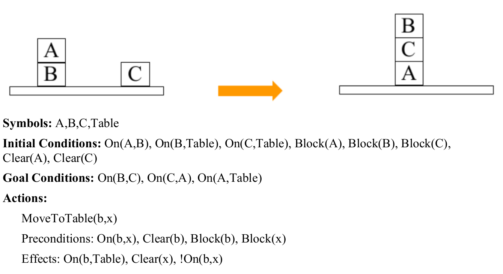
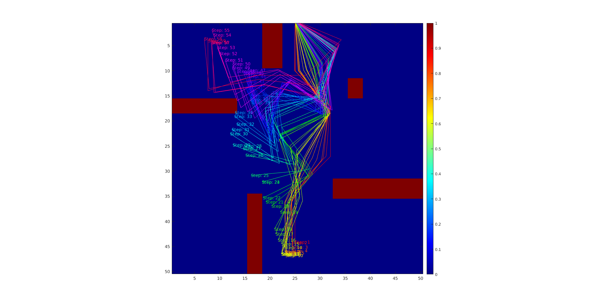

## Path-Planning

## Symbolic Planner (HW 3) 
### Implemented a planner that gets an environment object as an input and outputs a sequence of actions to go from the start to the goal.

## PLanning for a 6DOF arm (HW 2) 
### Implemented RRT, RRT*, and RRT-Connect for a 6 DOF robotic arm 

## Catching Moving Target (HW 1) 
### Dijkstra and weighted A* algorithms are used to generate valid paths for a robot to catch a moving target

